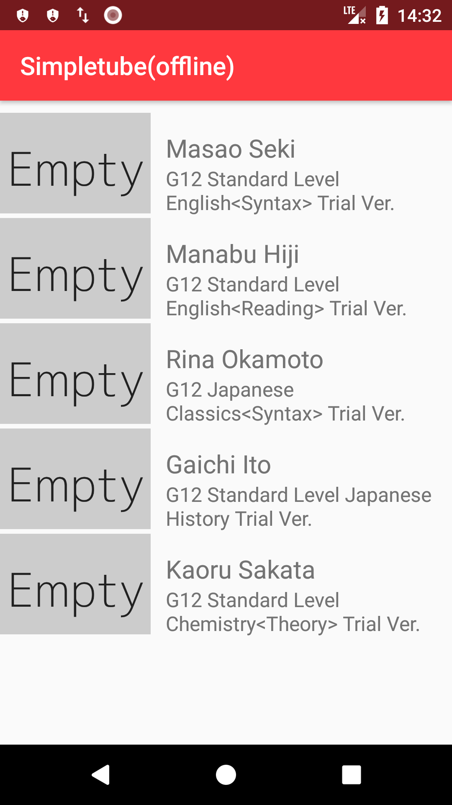
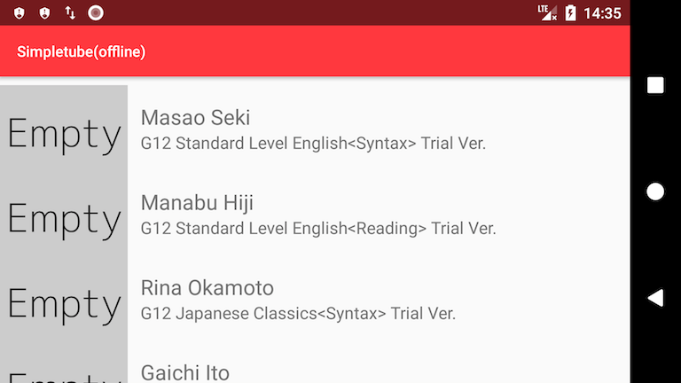
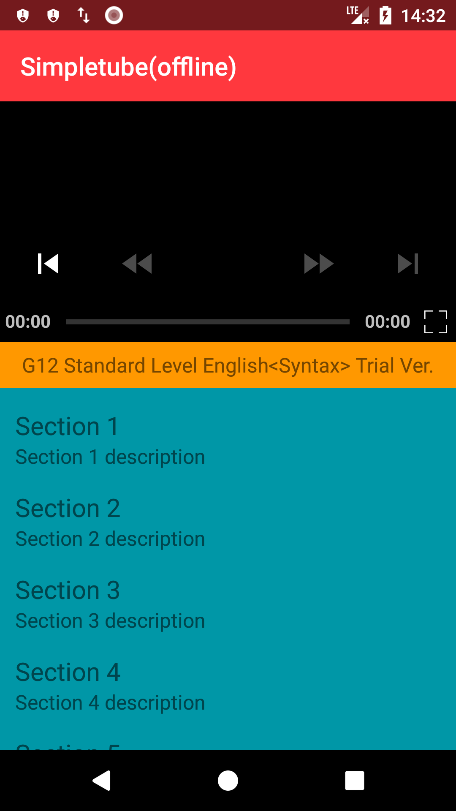
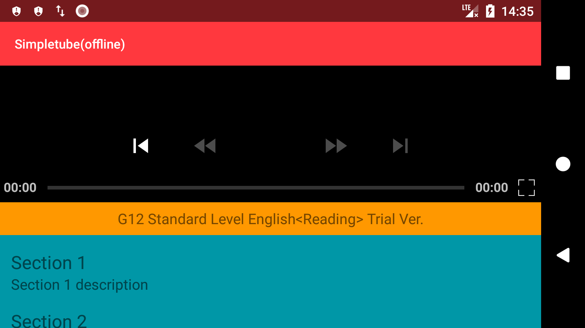
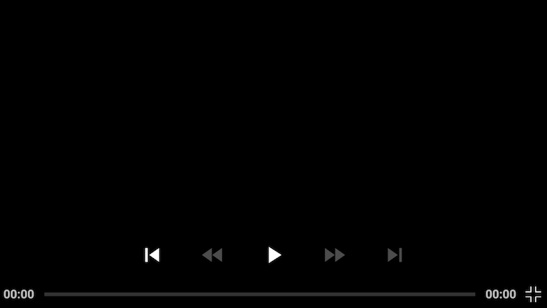
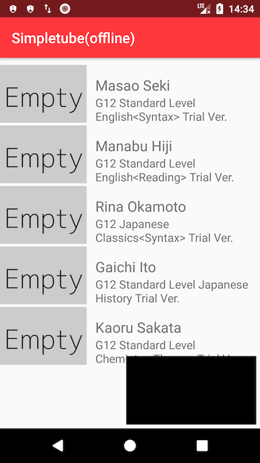
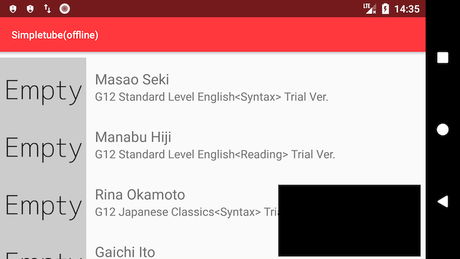

# Youtube-like Video Player

Play video from a list that a JSON format file fetched through the internet and 
while playing the video you can drag the video view to smaller one then you can look the list. 
If you want to stop the video you can just swipe the small video view to stop it.

## Languages, libraries and tools used

* [Android Component Architecture](https://developer.android.com/topic/libraries/architecture/index.html)
* [Kotlin](https://kotlinlang.org/)
* Android Support Libraries
* [RxJava2](https://github.com/ReactiveX/RxJava/wiki/What's-different-in-2.0)
* [Dagger 2 (2.14.1)](https://github.com/google/dagger)
* [Glide](https://github.com/bumptech/glide)
* [Retrofit](http://square.github.io/retrofit/)
* [OkHttp](http://square.github.io/okhttp/)
* [Gson](https://github.com/google/gson)
* [Timber](https://github.com/JakeWharton/timber)
* [Mockito](http://site.mockito.org/)
* [Espresso](https://developer.android.com/training/testing/espresso/index.html)
* [Robolectric](http://robolectric.org/)

## Environment Requirements

* JDK 1.8
* Minimal Android API level is 16
* Latest Android SDK Tools and build tools.
* Android Studio 3.0+

## Initial from

- https://github.com/lekaha/android-clean-architecture-component-boilerplate

## Demo

## Captures

### List

### Video

### Full Screen Video

### Small Video

